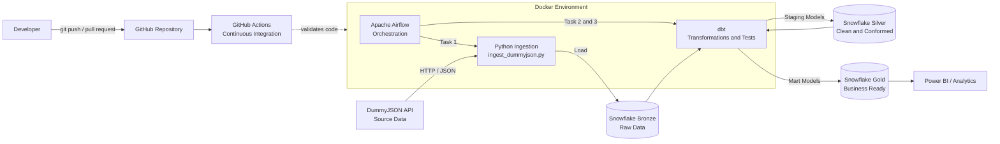

# E-commerce Data Pipeline

Pipeline de dados end-to-end para ingestão, transformação, teste e disponibilização de dados de e-commerce utilizando **DummyJSON**, **Python**, **Snowflake**, **dbt**, **Apache Airflow**, **Docker**, **GitHub Actions** e, opcionalmente, **Power BI**.

O projeto implementa uma arquitetura **Medallion** com as camadas **Bronze**, **Silver** e **Gold**. Os dados são extraídos da API DummyJSON, carregados na camada Bronze do Snowflake e transformados pelo dbt em modelos analíticos confiáveis. O Airflow orquestra toda a execução dentro de um ambiente Docker.

---

## Sumário

- [Visão geral](#visão-geral)
- [Arquitetura](#arquitetura)
- [Fluxo de execução](#fluxo-de-execução)
- [Tecnologias](#tecnologias)
- [Arquitetura Medallion](#arquitetura-medallion)
- [Fontes e tabelas](#fontes-e-tabelas)
- [Estrutura do projeto](#estrutura-do-projeto)
- [Pré-requisitos](#pré-requisitos)
- [Configuração do Snowflake](#configuração-do-snowflake)
- [Variáveis de ambiente](#variáveis-de-ambiente)
- [Configuração do dbt](#configuração-do-dbt)
- [Como executar](#como-executar)
- [Orquestração com Airflow](#orquestração-com-airflow)
- [Transformações com dbt](#transformações-com-dbt)
- [CI com GitHub Actions](#ci-com-github-actions)
- [Validação dos dados](#validação-dos-dados)
- [Segurança](#segurança)
- [Solução de problemas](#solução-de-problemas)
- [Melhorias futuras](#melhorias-futuras)

---

## Visão geral

Este projeto simula uma plataforma de dados de e-commerce com as seguintes entidades:

- **Customers:** dados dos clientes.
- **Products:** catálogo de produtos.
- **Orders:** pedidos e itens comprados.
- **Categories:** dados de referência carregados por seed.
- **States:** dados de referência carregados por seed.

A pipeline é executada diariamente pelo Airflow:

```text
ingest_dummyjson_to_snowflake
                ↓
             dbt run
                ↓
             dbt test
```

O resultado é uma camada Gold pronta para consumo por ferramentas analíticas, como Power BI.

---

## Arquitetura



### Responsabilidade de cada componente

| Componente | Responsabilidade |
|---|---|
| **DummyJSON** | Fonte externa de dados em formato JSON. |
| **Python** | Extrai dados da API e os carrega no Snowflake. |
| **Snowflake** | Armazena as camadas Bronze, Silver e Gold. |
| **dbt** | Transforma, documenta e testa os dados dentro do Snowflake. |
| **Airflow** | Orquestra a ordem e a periodicidade das tarefas. |
| **Docker** | Padroniza e isola o ambiente de execução. |
| **GitHub** | Versiona o código-fonte e centraliza a colaboração. |
| **GitHub Actions** | Executa validações automáticas de CI. |
| **Power BI** | Consome a camada Gold para análises e dashboards. |

---

## Fluxo de execução

A sequência operacional do projeto é:

```text
Docker
  ↓
Apache Airflow
  ↓
ingest_dummyjson.py
  ↓
DummyJSON API
  ↓
Snowflake Bronze
  ↓
dbt run
  ↓
Snowflake Silver
  ↓
Snowflake Gold
  ↓
dbt test
  ↓
Power BI / Analytics
```

Embora o Airflow apareça no início da sequência, ele atua como **orquestrador**. Sua função é iniciar e controlar as tarefas de ingestão, transformação e teste.

O fluxo de desenvolvimento e CI é separado do fluxo dos dados:

```text
Developer
   ↓
GitHub
   ↓
GitHub Actions
   ↓
Validação do código
```

---

## Tecnologias

- **Python**
- **Requests**
- **Snowflake Connector for Python**
- **Snowflake**
- **dbt Core**
- **dbt-snowflake**
- **Apache Airflow**
- **Docker**
- **Docker Compose**
- **Git**
- **GitHub**
- **GitHub Actions**
- **Power BI**, como camada de consumo opcional

Dependências principais:

```text
dbt-snowflake==1.8.0
requests
snowflake-connector-python
```

Imagem base do Airflow:

```dockerfile
FROM apache/airflow:2.9.3

COPY requirements.txt /requirements.txt
RUN pip install --no-cache-dir -r /requirements.txt
```

---

## Arquitetura Medallion

A arquitetura Medallion organiza os dados em camadas com diferentes níveis de qualidade e finalidade.

### Bronze — Raw Data / Landing Zone

A camada Bronze recebe os dados extraídos da API com o mínimo possível de transformação.

Responsabilidades:

- Receber os dados de origem.
- Preservar os campos necessários para rastreabilidade.
- Servir como ponto inicial de reprocessamento.
- Isolar a ingestão das regras analíticas.

Tabelas:

- `BRONZE.CUSTOMERS`
- `BRONZE.PRODUCTS`
- `BRONZE.ORDERS`

### Silver — Clean and Conformed

A camada Silver contém dados limpos, tipados, padronizados e enriquecidos.

Responsabilidades:

- Remover ou tratar valores inválidos.
- Padronizar nomes e tipos.
- Aplicar regras de qualidade.
- Integrar dados de referência.
- Preparar entidades reutilizáveis para modelos analíticos.

No projeto, os modelos de **staging** do dbt representam principalmente essa camada.

### Gold — Business Ready / Data Marts

A camada Gold contém modelos orientados a negócio e prontos para consumo.

Responsabilidades:

- Criar métricas e indicadores.
- Organizar tabelas analíticas.
- Simplificar o consumo por BI.
- Representar conceitos de negócio de forma consistente.

No projeto, os modelos em `models/marts` representam essa camada.

---

## Fontes e tabelas

### `BRONZE.CUSTOMERS`

| Coluna | Tipo | Descrição |
|---|---|---|
| `customer_id` | `INT` | Identificador do cliente. |
| `full_name` | `STRING` | Nome completo. |
| `email` | `STRING` | Endereço de e-mail. |
| `state` | `STRING` | Estado do cliente. |
| `city` | `STRING` | Cidade do cliente. |

### `BRONZE.PRODUCTS`

| Coluna | Tipo | Descrição |
|---|---|---|
| `product_id` | `INT` | Identificador do produto. |
| `product_name` | `STRING` | Nome do produto. |
| `category_id` | `INT` | Identificador da categoria. |
| `price` | `NUMBER(10,2)` | Preço unitário. |

### `BRONZE.ORDERS`

| Coluna | Tipo | Descrição |
|---|---|---|
| `order_id` | `INT` | Identificador do pedido. |
| `customer_id` | `INT` | Cliente associado ao pedido. |
| `product_id` | `INT` | Produto associado ao pedido. |
| `quantity` | `INT` | Quantidade comprada. |
| `order_date` | `DATE` | Data do pedido. |

### Seeds

O projeto utiliza arquivos CSV em `dbt/seeds` para carregar dados de referência:

- `categories.csv`
- `states.csv`

Esses arquivos permitem enriquecer os modelos sem depender de outra API ou sistema de origem.

---

## Estrutura do projeto

A estrutura abaixo representa a organização recomendada. Ajuste os nomes caso o seu repositório utilize caminhos diferentes.

```text
ecommerce-data-pipeline/
├── .github/
│   └── workflows/
│       └── ci.yml
├── airflow/
│   ├── dags/
│   │   └── ecommerce_pipeline.py
│   ├── Dockerfile
│   ├── docker-compose.yml
│   ├── requirements.txt
│   └── .env
├── dbt/
│   ├── analyses/
│   ├── macros/
│   ├── models/
│   │   ├── staging/
│   │   └── marts/
│   ├── seeds/
│   │   ├── categories.csv
│   │   └── states.csv
│   ├── dbt_project.yml
│   ├── packages.yml
│   └── README.md
├── ingestion/
│   └── ingest_dummyjson.py
├── snowflake/
│   └── setup.sql
├── docs/
│   └── architecture.png
├── .gitignore
└── README.md
```

### Diretórios dbt

| Diretório | Finalidade |
|---|---|
| `models/staging` | Limpeza, tipagem e padronização dos dados da Bronze. |
| `models/marts` | Modelos analíticos e regras de negócio da camada Gold. |
| `seeds` | Arquivos CSV de referência carregados pelo dbt. |
| `macros` | Funções SQL reutilizáveis. |
| `analyses` | Consultas analíticas que não são materializadas como modelos. |

---

## Pré-requisitos

Para executar o projeto em outra máquina, são necessários:

1. **Git**
2. **Docker Desktop** ou Docker Engine com Docker Compose
3. Uma conta ativa no **Snowflake**
4. Permissão para criar database, schemas e tabelas no Snowflake
5. Porta local do Airflow disponível, normalmente `8080`
6. Pelo menos 4 GB de memória disponíveis para o Docker; 8 GB é recomendado

Não é necessário instalar Airflow, dbt ou o conector Snowflake diretamente na máquina host. Essas dependências são instaladas dentro da imagem Docker.

---

## Configuração do Snowflake

Acesse um worksheet no Snowflake e execute:

```sql
CREATE OR REPLACE DATABASE ECOMMERCE_DB;

CREATE OR REPLACE SCHEMA ECOMMERCE_DB.BRONZE;
CREATE OR REPLACE SCHEMA ECOMMERCE_DB.SILVER;
CREATE OR REPLACE SCHEMA ECOMMERCE_DB.GOLD;

USE DATABASE ECOMMERCE_DB;

CREATE OR REPLACE TABLE BRONZE.CUSTOMERS (
    customer_id INT,
    full_name STRING,
    email STRING,
    state STRING,
    city STRING
);

CREATE OR REPLACE TABLE BRONZE.PRODUCTS (
    product_id INT,
    product_name STRING,
    category_id INT,
    price NUMBER(10,2)
);

CREATE OR REPLACE TABLE BRONZE.ORDERS (
    order_id INT,
    customer_id INT,
    product_id INT,
    quantity INT,
    order_date DATE
);
```

### Verificação

```sql
SHOW SCHEMAS IN DATABASE ECOMMERCE_DB;
SHOW TABLES IN SCHEMA ECOMMERCE_DB.BRONZE;
```

Resultado esperado:

- Schemas `BRONZE`, `SILVER` e `GOLD`.
- Tabelas `CUSTOMERS`, `PRODUCTS` e `ORDERS` na Bronze.

> `CREATE OR REPLACE` recria os objetos e pode apagar dados existentes. Em ambientes persistentes, prefira `CREATE IF NOT EXISTS` ou migrations controladas.

---

## Variáveis de ambiente

Crie um arquivo `.env` no mesmo diretório do `docker-compose.yml`.

Exemplo:

```env
SNOWFLAKE_ACCOUNT=seu_account_identifier
SNOWFLAKE_USER=seu_usuario
SNOWFLAKE_PASSWORD=sua_senha
SNOWFLAKE_ROLE=seu_role
SNOWFLAKE_WAREHOUSE=seu_warehouse
SNOWFLAKE_DATABASE=ECOMMERCE_DB
SNOWFLAKE_SCHEMA=BRONZE

AIRFLOW_UID=50000
```

Dependendo da implementação, também podem ser utilizados:

```env
SNOWFLAKE_PRIVATE_KEY_PATH=
SNOWFLAKE_REGION=
DBT_PROFILES_DIR=/home/airflow/.dbt
```

O `docker-compose.yml` deve disponibilizar essas variáveis aos serviços do Airflow, por exemplo:

```yaml
environment:
  SNOWFLAKE_ACCOUNT: ${SNOWFLAKE_ACCOUNT}
  SNOWFLAKE_USER: ${SNOWFLAKE_USER}
  SNOWFLAKE_PASSWORD: ${SNOWFLAKE_PASSWORD}
  SNOWFLAKE_ROLE: ${SNOWFLAKE_ROLE}
  SNOWFLAKE_WAREHOUSE: ${SNOWFLAKE_WAREHOUSE}
  SNOWFLAKE_DATABASE: ${SNOWFLAKE_DATABASE}
  SNOWFLAKE_SCHEMA: ${SNOWFLAKE_SCHEMA}
```

### Segurança

Nunca envie o arquivo `.env` para o GitHub.

Inclua no `.gitignore`:

```gitignore
.env
*.env
profiles.yml
logs/
target/
dbt_packages/
__pycache__/
*.pyc
```

É recomendado versionar um `.env.example` sem credenciais reais.

---

## Configuração do dbt

O dbt precisa de um arquivo `profiles.yml`. O nome do profile deve ser igual ao valor da chave `profile:` no `dbt_project.yml`.

Exemplo:

```yaml
ecommerce:
  target: dev
  outputs:
    dev:
      type: snowflake
      account: "{{ env_var('SNOWFLAKE_ACCOUNT') }}"
      user: "{{ env_var('SNOWFLAKE_USER') }}"
      password: "{{ env_var('SNOWFLAKE_PASSWORD') }}"
      role: "{{ env_var('SNOWFLAKE_ROLE') }}"
      warehouse: "{{ env_var('SNOWFLAKE_WAREHOUSE') }}"
      database: "{{ env_var('SNOWFLAKE_DATABASE', 'ECOMMERCE_DB') }}"
      schema: SILVER
      threads: 4
      client_session_keep_alive: false
```

No projeto atual, a DAG executa:

```bash
dbt run --profiles-dir /home/airflow/.dbt
dbt test --profiles-dir /home/airflow/.dbt
```

Portanto, o `profiles.yml` precisa estar montado no container em:

```text
/home/airflow/.dbt/profiles.yml
```

Exemplo de volume no Compose:

```yaml
volumes:
  - ~/.dbt:/home/airflow/.dbt
```

Para tornar o projeto portátil entre Windows, Linux e macOS, prefira uma variável:

```yaml
volumes:
  - ${DBT_PROFILES_DIR}:/home/airflow/.dbt
```

No `.env`:

```env
DBT_PROFILES_DIR=/caminho/da/maquina/.dbt
```

No Windows com WSL ou Docker Desktop, confirme o formato aceito pelo Docker para o caminho local.

---

## Como executar

### 1. Clonar o repositório

```bash
git clone <URL_DO_REPOSITORIO>
cd ecommerce-data-pipeline
```

### 2. Criar as estruturas no Snowflake

Execute o conteúdo de `snowflake/setup.sql` em um worksheet do Snowflake.

### 3. Criar o `.env`

```bash
cp airflow/.env.example airflow/.env
```

Preencha o arquivo com as credenciais corretas.

Caso não exista um `.env.example`, crie manualmente o arquivo seguindo a seção [Variáveis de ambiente](#variáveis-de-ambiente).

### 4. Configurar o `profiles.yml`

Crie:

```text
~/.dbt/profiles.yml
```

Use o profile definido na seção [Configuração do dbt](#configuração-do-dbt).

### 5. Validar o Docker Compose

```bash
cd airflow
docker compose config
```

O comando deve concluir sem erros de YAML ou variáveis obrigatórias ausentes.

### 6. Construir a imagem

```bash
docker compose build --no-cache
```

A imagem instala:

```text
dbt-snowflake==1.8.0
requests
snowflake-connector-python
```

### 7. Inicializar o Airflow

Caso o Compose utilize o serviço padrão `airflow-init`:

```bash
docker compose up airflow-init
```

### 8. Subir os containers

```bash
docker compose up -d
```

### 9. Verificar os serviços

```bash
docker compose ps
```

Também é possível acompanhar os logs:

```bash
docker compose logs -f
```

Para um serviço específico:

```bash
docker compose logs -f airflow-scheduler
```

### 10. Carregar os seeds do dbt

A DAG fornecida executa `dbt run` e `dbt test`, mas não executa `dbt seed`.

Por isso, antes da primeira execução, carregue os seeds:

```bash
docker compose exec airflow-worker bash -lc \
  "cd /opt/airflow/dbt && dbt seed --profiles-dir /home/airflow/.dbt"
```

Caso o seu Compose não possua o serviço `airflow-worker`, execute no serviço que contém o dbt, como `airflow-scheduler`.

Uma alternativa é adicionar `dbt seed` à DAG antes de `dbt run`.

### 11. Abrir a interface do Airflow

Acesse:

```text
http://localhost:8080
```

Use as credenciais definidas no Docker Compose. Em configurações locais baseadas no exemplo oficial do Airflow, é comum utilizar:

```text
Usuário: airflow
Senha: airflow
```

### 12. Executar a DAG

Na interface:

1. Localize `ecommerce_pipeline`.
2. Ative a DAG.
3. Clique em **Trigger DAG**.
4. Acompanhe as tarefas no Grid ou Graph View.

Também é possível disparar pela linha de comando:

```bash
docker compose exec airflow-scheduler \
  airflow dags trigger ecommerce_pipeline
```

### 13. Verificar os dados no Snowflake

```sql
SELECT COUNT(*) FROM ECOMMERCE_DB.BRONZE.CUSTOMERS;
SELECT COUNT(*) FROM ECOMMERCE_DB.BRONZE.PRODUCTS;
SELECT COUNT(*) FROM ECOMMERCE_DB.BRONZE.ORDERS;

SHOW TABLES IN SCHEMA ECOMMERCE_DB.SILVER;
SHOW TABLES IN SCHEMA ECOMMERCE_DB.GOLD;
```

### 14. Encerrar o ambiente

```bash
docker compose down
```

Para remover também volumes locais:

```bash
docker compose down -v
```

> O uso de `-v` apaga volumes do ambiente Docker, incluindo metadados locais do Airflow. Use com cuidado.

---

## Orquestração com Airflow

A DAG executa diariamente e não processa períodos anteriores automaticamente:

```python
from airflow import DAG
from airflow.operators.bash import BashOperator
from datetime import datetime

with DAG(
    dag_id="ecommerce_pipeline",
    start_date=datetime(2024, 1, 1),
    schedule="@daily",
    catchup=False,
) as dag:

    ingest_data = BashOperator(
        task_id="ingest_dummyjson_to_snowflake",
        bash_command=(
            "python /opt/airflow/ingestion/"
            "ingest_dummyjson.py"
        ),
    )

    dbt_run = BashOperator(
        task_id="dbt_run",
        bash_command=(
            "cd /opt/airflow/dbt && "
            "dbt run --profiles-dir /home/airflow/.dbt"
        ),
    )

    dbt_test = BashOperator(
        task_id="dbt_test",
        bash_command=(
            "cd /opt/airflow/dbt && "
            "dbt test --profiles-dir /home/airflow/.dbt"
        ),
    )

    ingest_data >> dbt_run >> dbt_test
```

### Dependências

```text
ingest_data >> dbt_run >> dbt_test
```

Isso garante que:

1. O dbt só execute se a ingestão terminar com sucesso.
2. Os testes só executem se os modelos forem criados com sucesso.
3. Uma falha interrompa as tarefas dependentes.

### Agendamento

```python
schedule="@daily"
```

A DAG é programada para execução diária.

```python
catchup=False
```

O Airflow não cria execuções retroativas desde a `start_date`.

---

## Transformações com dbt

O dbt executa transformações SQL diretamente no Snowflake.

### Staging

Os modelos de staging normalmente:

- renomeiam colunas;
- convertem tipos;
- removem duplicidades;
- tratam valores nulos;
- padronizam textos;
- criam chaves e campos derivados;
- enriquecem os dados com seeds.

### Marts

Os modelos de marts normalmente:

- integram customers, products e orders;
- calculam valores de pedido;
- criam métricas por cliente, produto, categoria, cidade ou estado;
- disponibilizam tabelas prontas para consumo pelo Power BI.

### Macros

As macros evitam repetição de SQL e centralizam regras reutilizáveis.

Exemplos de uso:

- padronização de strings;
- geração de chaves;
- tratamento de datas;
- regras de cálculo;
- lógica condicional reutilizável.

### Analyses

A pasta `analyses` contém consultas exploratórias ou analíticas que não precisam ser materializadas como tabelas ou views.

### Seeds

Para carregar:

```bash
dbt seed --profiles-dir /home/airflow/.dbt
```

### Execução manual

```bash
dbt debug --profiles-dir /home/airflow/.dbt
dbt seed --profiles-dir /home/airflow/.dbt
dbt run --profiles-dir /home/airflow/.dbt
dbt test --profiles-dir /home/airflow/.dbt
```

### Documentação do dbt

```bash
dbt docs generate --profiles-dir /home/airflow/.dbt
dbt docs serve --profiles-dir /home/airflow/.dbt
```

---

## CI com GitHub Actions

O GitHub Actions é utilizado como camada de **Continuous Integration**.

O CI deve ser acionado por eventos como:

- push;
- pull request;
- alteração em arquivos Python, dbt ou Docker.

Validações recomendadas:

- sintaxe e qualidade do Python;
- importação das DAGs do Airflow;
- compilação dos modelos dbt;
- testes dbt;
- validação do `docker-compose.yml`;
- verificação de dependências;
- garantia de que segredos não foram versionados.

Exemplo de fluxo:

```text
git push
   ↓
GitHub Repository
   ↓
GitHub Actions
   ├── Validate Python
   ├── Validate Airflow DAG
   ├── Validate Docker Compose
   ├── Compile dbt
   └── Run automated tests
```

As validações exatas dependem do workflow presente em:

```text
.github/workflows/
```

Credenciais do Snowflake, quando necessárias no CI, devem ser cadastradas em **GitHub Actions Secrets**, nunca diretamente no YAML.

---

## Validação dos dados

O projeto utiliza `dbt test` após a construção dos modelos.

Testes recomendados em `schema.yml`:

```yaml
version: 2

models:
  - name: stg_customers
    columns:
      - name: customer_id
        tests:
          - not_null
          - unique

      - name: email
        tests:
          - not_null

  - name: stg_products
    columns:
      - name: product_id
        tests:
          - not_null
          - unique

      - name: price
        tests:
          - not_null

  - name: stg_orders
    columns:
      - name: order_id
        tests:
          - not_null
          - unique

      - name: customer_id
        tests:
          - relationships:
              to: ref('stg_customers')
              field: customer_id

      - name: product_id
        tests:
          - relationships:
              to: ref('stg_products')
              field: product_id
```

Outras verificações úteis:

- quantidade maior que zero;
- preço não negativo;
- e-mail com formato válido;
- datas não futuras;
- chaves estrangeiras existentes;
- categorias válidas;
- estados presentes no seed de referência.

---

## Segurança

Boas práticas adotadas ou recomendadas:

- Credenciais armazenadas em `.env`.
- `.env` incluído no `.gitignore`.
- `profiles.yml` fora do versionamento.
- Segredos do CI armazenados no GitHub Actions Secrets.
- Uso de usuário e role dedicados no Snowflake.
- Princípio do menor privilégio.
- Nenhuma senha escrita em DAGs, scripts Python ou arquivos SQL.
- Rotação periódica de credenciais.

Exemplo de permissões mínimas:

```sql
GRANT USAGE ON WAREHOUSE <WAREHOUSE> TO ROLE <ROLE>;
GRANT USAGE ON DATABASE ECOMMERCE_DB TO ROLE <ROLE>;
GRANT USAGE ON ALL SCHEMAS IN DATABASE ECOMMERCE_DB TO ROLE <ROLE>;
GRANT SELECT, INSERT, UPDATE, DELETE
ON ALL TABLES IN SCHEMA ECOMMERCE_DB.BRONZE
TO ROLE <ROLE>;
```

A definição exata deve refletir as operações executadas pelo dbt e pelo script de ingestão.

---

## Solução de problemas

### A DAG não aparece no Airflow

Verifique erros de importação:

```bash
docker compose exec airflow-scheduler airflow dags list-import-errors
```

Confirme que o arquivo está montado em:

```text
/opt/airflow/dags/
```

### `ingest_dummyjson.py` não é encontrado

Verifique o volume:

```bash
docker compose exec airflow-worker \
  ls -la /opt/airflow/ingestion
```

O comando da DAG precisa corresponder exatamente ao nome do arquivo:

```text
/opt/airflow/ingestion/ingest_dummyjson.py
```

### O dbt não encontra o profile

Verifique:

```bash
docker compose exec airflow-worker \
  ls -la /home/airflow/.dbt
```

Depois execute:

```bash
docker compose exec airflow-worker bash -lc \
  "cd /opt/airflow/dbt && dbt debug --profiles-dir /home/airflow/.dbt"
```

### Erro de autenticação no Snowflake

Confirme:

- account identifier;
- usuário;
- senha;
- role;
- warehouse;
- database;
- variáveis disponíveis dentro do container.

```bash
docker compose exec airflow-worker env | grep SNOWFLAKE
```

Evite publicar a saída desse comando, pois ela pode conter informações sensíveis.

### Seeds não encontrados

Execute:

```bash
dbt seed
```

A DAG atual não carrega os seeds automaticamente.

### Alterações no `requirements.txt` não aparecem

Reconstrua a imagem:

```bash
docker compose build --no-cache
docker compose up -d
```

### Erro de YAML no Compose

Valide antes de subir:

```bash
docker compose config --quiet
```

---

## Melhorias futuras

Possíveis evoluções:

- ingestão incremental;
- uso de `MERGE` no Snowflake;
- controle de duplicidades;
- colunas de auditoria, como `ingested_at` e `source_updated_at`;
- retries e timeout nas tarefas do Airflow;
- alertas de falha;
- `dbt seed` integrado à DAG;
- snapshots e Slowly Changing Dimensions;
- testes unitários com `pytest`;
- observabilidade e data quality;
- refresh automatizado do Power BI;
- ambientes separados para desenvolvimento e produção;
- infraestrutura como código;
- autenticação Snowflake por chave privada;
- deploy do Airflow em serviço gerenciado.

---

## Resultado

O projeto demonstra competências em:

- integração com API REST;
- ingestão de dados com Python;
- modelagem Medallion;
- data warehouse em Snowflake;
- transformação e testes com dbt;
- orquestração com Airflow;
- containerização com Docker;
- versionamento com GitHub;
- integração contínua com GitHub Actions;
- preparação de dados para BI.

---

## Autor

Desenvolvido como projeto de portfólio em Engenharia de Dados.

```text
Nome: <Rafael Oliveira>
LinkedIn: <https://www.linkedin.com/in/rafael-oliveira-4013b4300/>
GitHub: <https://github.com/devrafael7/>
```
